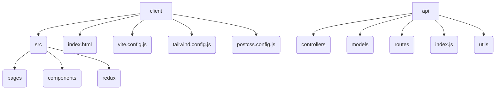

# BLOGVERSE

A full-stack blogging platform built with React, Node.js, and MongoDB.  Create, share, and discuss blog posts with a user-friendly interface.


## 📚 Table of Contents

- [Description](#description)
- [Tech Stack](#tech-stack)
- [Architecture Overview](#architecture-overview)
- [File Structure](#file-structure)
- [Features](#features)
- [Installation](#installation)
  - [Prerequisites](#prerequisites)
  - [Setup](#setup)
- [Usage](#usage)
  - [Execution Options](#execution-options)
- [Contributing](#contributing)
- [Contributors](#contributors)
- [License](#license)
- [Credits](#credits)


## Description

BLOGVERSE is a full-stack blogging application built using React for the frontend and Node.js with Express.js and MongoDB for the backend.  Users can create, read, update, and delete blog posts, comment on posts, and manage their profiles.  The application utilizes Firebase for authentication and includes features such as a search functionality, theme switching and user authentication.  The client-side renders dynamic pages using React Router, allowing for a seamless user experience.


## Tech Stack

[](https://nodejs.org/) [](https://expressjs.com/) [](https://reactjs.org/) [](https://www.mongodb.com/) [](https://tailwindcss.com/) [](https://firebase.google.com/) [](https://redux.js.org/) [](https://html.spec.whatwg.org/) [](https://www.w3.org/Style/CSS/) [](https://developer.mozilla.org/en-US/docs/Web/JavaScript) [](https://github.com/PIYUSH1SAINI/ReadMe-wiz.git)


## Architecture Overview

```mermaid
graph LR
    subgraph Frontend
        A[React Components] --> B(React Router)
        B --> C{Pages (Home, CreatePost, etc.)}
        A --> D(Redux Store)
    end
    subgraph Backend
        E[API Routes (Express)] --> F(Controllers)
        F --> G(MongoDB)
        E --> H(Authentication (Firebase))
    end
    C --> E
    D --> E

```

## File Structure



## Features

*   **User Authentication:** Secure user registration and login using Firebase Authentication.
*   **Blog Post Creation and Management:** Create, edit, and delete blog posts with a rich text editor.
*   **Comment Section:** Engage with other users through comments on individual blog posts.
*   **Search Functionality:** Easily find specific blog posts using keywords.
*   **Interactive UI:** User-friendly interface built using React components for a smooth user experience.
*   **Dark Mode:** Supports switching between light and dark themes.


## Installation

### Prerequisites

> [!NOTE]
> Node.js >=14 and npm are required for this project.  Ensure you have them installed before proceeding.


### Setup

1.  **Clone Repository:** Clone the repository from GitHub and set up the project locally.
    ```bash
    git clone https://github.com/raghavG0212/BLOGVERSE.git
    cd BLOGVERSE
    ```
2.  **Install Dependencies:** Install the necessary packages for the frontend and backend.
    ```bash
    npm install
    npm install --prefix client
    ```
3. **Build the frontend**: Build the React application.
    ```bash
    npm run build --prefix client
    ```
4. **Start the backend**: Start the Node.js server
    ```bash
    npm start
    ```

> [!TIP]
> The fastest way to get started is by cloning the repository and running `npm install` followed by `npm start`.


## Usage

### Execution Options

#### Backend Execution

To run the backend server, navigate to the `api` directory and execute:


```bash
npm start
```

> [!IMPORTANT]
> Ensure you have configured the necessary environment variables (e.g., MongoDB connection string, Firebase config) before running the application.

#### Frontend Execution

The frontend is built as a separate React application.  After building the frontend (step 3 in the Setup section), the backend server will serve the built frontend files.


## Contributing

We welcome contributions! Please feel free to open issues or submit pull requests through GitHub.


## Contributors

<a href="https://github.com/raghavG0212" target="_blank"></a>


## License

MIT License


## Credits

raghav, Node.js, Express.js, React, MongoDB, Firebase, Redux, Tailwind CSS, HTML5, CSS3, JavaScript


<a href="https://github.com/PIYUSH1SAINI/ReadMe-wiz.git" target="_blank">
      
    </a>
